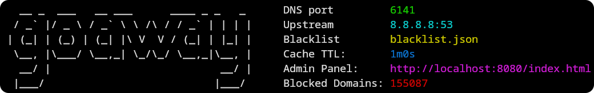

# GoAway - DNS Sinkhole


A lightweight DNS sinkhole for blocking unwanted domains at the network level. Block ads, trackers, and malicious domains before they reach your devices.


**[View more screenshots](./resources/PREVIEW.md)**

## 🌟 Features

- DNS-level domain blocking
- Web-based admin dashboard
- Cross-platform support
- Docker support
- Customizable blocking rules
- Real-time statistics
- Low resource footprint
- And much more...

## 📦 Installation

### Option 1: Docker Installation (Recommended)

**Quick Start:**

```bash
docker run -d \
    --name goaway \
    -p 53:53/udp \
    -p 53:53/tcp \
    -p 8080:8080 \
    pommee/goaway:latest
```

**Using Docker Compose (Recommended for production):**

```bash
# Download the compose file
curl -O https://raw.githubusercontent.com/pommee/goaway/main/docker-compose.yml

# Start the service
docker compose up -d
```

### Option 2: Quick Install

**Quick Install Script:**

```bash
# Install latest version
curl https://raw.githubusercontent.com/pommee/goaway/main/installer.sh | sh

# Install specific version
curl https://raw.githubusercontent.com/pommee/goaway/main/installer.sh | sh /dev/stdin 0.40.4
```

The installer will:

1. Detect your operating system and architecture
2. Download the appropriate binary
3. Install it to `~/.local/bin`
4. Set up necessary permissions

**Manual Installation:**
Download binaries directly from the [releases page](https://github.com/pommee/goaway/releases).

### Option 3: Build from Source

```bash
# Clone the repository
git clone https://github.com/pommee/goaway.git
cd goaway

# Build the frontend
make build

# Build GoAway binary
go build -o goaway

# Start the service
./goaway
```

## 🚀 Getting Started

### Basic Usage

Start GoAway with default settings:

```bash
goaway
```

You'll see a startup message confirming the services are running:



> [!IMPORTANT]
> **First-time Setup:** GoAway runs in authenticated mode by default and generates a random password on first startup. This password is shown only once - make sure to save it!

### Accessing the Dashboard

1. Open your browser and navigate to `http://your-server-ip:port`
2. Default username: `admin`
3. Use the generated password from startup

### Configure Your Devices

To use GoAway as your DNS server, update your device or router settings:

**Router Configuration (Recommended):**

- Set your router's DNS server to GoAway's IP address
- This will protect all devices on your network

**Individual Device:**

- Update DNS settings to point to GoAway's IP address
- Primary DNS: `<goaway-server-ip>`
- Secondary DNS: `1.1.1.1` or `8.8.8.8` - Used as a fallback

### Command Line Options

```bash
goaway --help

GoAway is a DNS sinkhole with a web interface

Usage:
  goaway [flags]

Flags:
  -h, --help                       help for goaway
      --ansi                       Toggle colorized logs. Only available in non-json formatted logs (default true)
      --auth                       Toggle authentication for admin dashboard (default true)
      --dns-port int               Port for the DNS server (default 53)
      --json                       Toggle JSON formatted logs
      --log-level int              0 = DEBUG | 1 = INFO | 2 = WARNING | 3 = ERROR (default 1)
      --logging                    Toggle logging (default true)
      --statistics-retention int   Days to keep statistics (default 7)
      --webserver-port int         Port for the web server (default 8080)
```

### Configuration File

Settings are stored in [settings.yaml](https://github.com/pommee/goaway/blob/main/settings.yaml). You can customize blocking rules, upstream DNS servers, and other options through the web dashboard or by editing this file directly.

### Examples

**Run on custom ports:**

```bash
goaway --dns-port 6121 --webserver-port 3000
```

**Disable authentication (not recommended for production):**

```bash
goaway --auth=false
```

**Enable debug logging:**

```bash
goaway --log-level 0
```

## 🔧 Development

### Running in Development Mode

The dashboard and server can be started separately for development with hot reloading:

```bash
# Start the web interface (with hot reload)
make dev-website

# Start the server (in another shell)
make dev-server
```

### Contributing

Contributions are welcomed! Here's how you can help:

1. **Report Issues:** Found a bug? [Create an issue](https://github.com/pommee/goaway/issues/new)
2. **Request Features:** Have an idea? [Start a discussion](https://github.com/pommee/goaway/discussions) or create a [feature request](https://github.com/pommee/goaway/issues/new/choose)
3. **Submit PRs:** Fork the repo, make changes, and submit a pull request

## ⚠️ Platform Support

| Platform | Architecture | Support Level |
| -------- | ------------ | ------------- |
| Linux    | amd64        | Full          |
| Linux    | arm64        | Full          |
| Linux    | 386          | Full          |
| macOS    | amd64        | Beta          |
| macOS    | arm64        | Beta          |
| Windows  | amd64        | Beta          |
| Windows  | 386          | Beta          |

> **Note**: Primary testing is conducted on Linux (amd64). While the aim is to support all listed platforms, functionality on macOS and Windows may vary.

## 🔍 Troubleshooting

### Common Issues

**Permission Denied (Port 53)**

- DNS servers typically require elevated privileges to bind to port 53

**Can't Access Dashboard**

- Check if port 8080 is available and not blocked by firewall
- Try accessing via `http://localhost:8080` on the same machine

**DNS Not Working**

- Verify GoAway is running and listening on the correct interface
- Check device DNS settings point to GoAway's IP address
- Test with `nslookup google.com <goaway-ip>` or `dig @<goaway-ip> google.com.`

## 📈 Performance

GoAway is designed to be lightweight and efficient:

- **Memory Usage:** Typically < 50MB RAM
- **CPU Usage:** Minimal impact on system performance
- **Network:** Low latency DNS resolution
- **Storage:** Logs and statistics use minimal disk space

## 📜 License

This project is licensed under the MIT License - see the [LICENSE](LICENSE) file for details.

## 🙏 Acknowledgments

This project is heavily inspired by [Pi-hole](https://github.com/pi-hole/pi-hole). Thanks to all people involved for their work.
