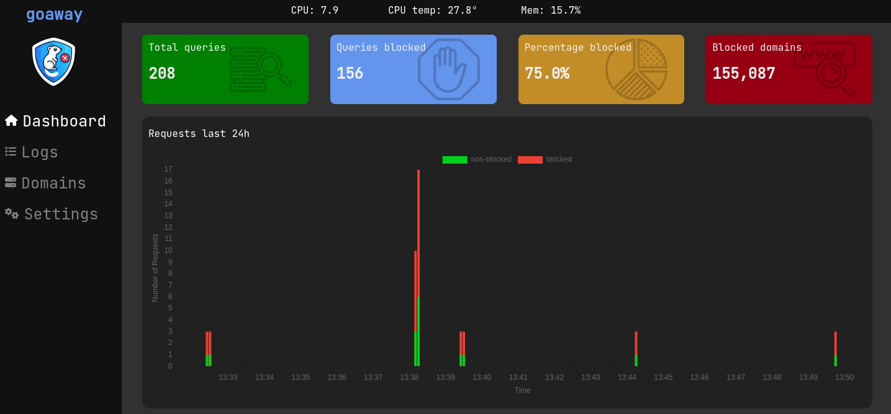

A lightweight DNS sinkhole for blocking unwanted domains at the network level. Block ads, trackers, and malicious domains before they reach your devices.

**[View more screenshots](./resources/PREVIEW.md)**

## Getting started

Instructions for installation, configuration and more can be found on the homepage: https://pommee.github.io/goaway

## Features

- DNS-level domain blocking
- Web-based admin dashboard
- Cross-platform support
- Docker support
- Customizable blocking rules
- Real-time statistics
- Low resource footprint
- And much more...

### Contributing

Contributions are welcomed! Here's how you can help:

1. **Report Issues:** Found a bug? [Create an issue](https://github.com/pommee/goaway/issues/new?template=bug_report.md)
2. **Request Features:** Have an idea? [Start a discussion](https://github.com/pommee/goaway/discussions) or create a [feature request](https://github.com/pommee/goaway/issues/new?template=feature_request.md)
3. **Submit PRs:** Before any work is started, create a new issue explaining what is wanted, why it would fit, how it can be done, so on and so forth...  
   Once the topic has been discussed with a maintainer then either you or a maintainer starts with the implementation. This is done to prevent any collisions, save time and confusion. [Read more here](./CONTRIBUTING.md)

## Platform Support

| Platform | Architecture | Support Level |
| -------- | ------------ | ------------- |
| Linux    | amd64        | Full          |
| Linux    | arm64        | Full          |
| Linux    | 386          | Full          |
| macOS    | amd64        | Beta          |
| macOS    | arm64        | Beta          |
| Windows  | amd64        | Beta          |
| Windows  | 386          | Beta          |

> **Note**: Primary testing is conducted on Linux (amd64). While the aim is to support all listed platforms, functionality on macOS and Windows may vary.

## Troubleshooting

### Common Issues

**Permission Denied (Port 53)**

- DNS servers typically require elevated privileges to bind to port 53

**Can't Access Dashboard**

- Check if port 8080 is available and not blocked by firewall
- Try accessing via `http://localhost:8080` on the same machine

**DNS Not Working**

- Verify GoAway is running and listening on the correct interface
- Check device DNS settings point to GoAway's IP address
- Test with `nslookup google.com <goaway-ip>` or `dig @<goaway-ip> google.com.`

## Performance

GoAway is designed to be lightweight and efficient:

- **Memory Usage:** Typically < 50MB RAM
- **CPU Usage:** Minimal impact on system performance
- **Network:** Low latency DNS resolution
- **Storage:** Logs and statistics use minimal disk space

## License

This project is licensed under the MIT License - see the [LICENSE](LICENSE) file for details.

## Acknowledgments

This project is heavily inspired by [Pi-hole](https://github.com/pi-hole/pi-hole). Thanks to all people involved for their work.
