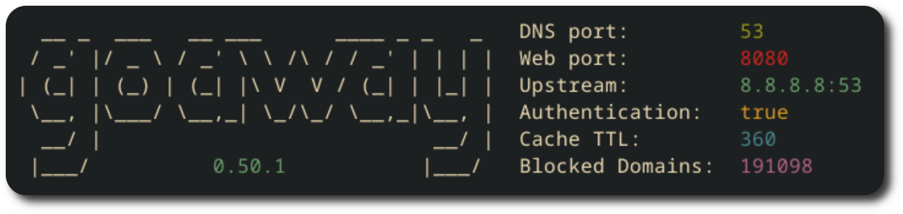

### Basic Usage

Start GoAway with default settings:

```shell
$ goaway
```

You'll see a startup message confirming the services are running:



!!! warning "First-time Setup"

    GoAway runs in authenticated mode by default and generates a random password on first startup. This password is shown only once in the logs - make sure to save it!

### Accessing the Dashboard

1. Open your browser and navigate to `http://your-server-ip:port`
2. Default username: `admin`
3. Use the generated password from startup

### Configure Your Devices

To use GoAway as your DNS server, update your device or router settings:

**Router Configuration (Recommended):**

- Set your router's DNS server to GoAway's IP address
- This will protect all devices on your network

**Individual Device:**

- Update DNS settings to point to GoAway's IP address
- Primary DNS: `<goaway-server-ip>`
- Secondary DNS: `1.1.1.1` or `8.8.8.8` - Used as a fallback

### Command Line Options

```
goaway --help

Usage:
  goaway [flags]

Flags:
  --ansi                       Toggle colorized logs. Only available in non-json formatted logs (default true)
  --auth                       Toggle authentication for admin dashboard (default true)
  --dashboard                  Serve dashboard (default true)
  --dns-port int               Port for the DNS server (default 53)
  --dot-port int               Port for the DoT (DNS-over-TCP) server (default 853)
  --json                       Toggle JSON formatted logs
  --log-level int              0 = DEBUG | 1 = INFO | 2 = WARNING | 3 = ERROR (default 1)
  --logging                    Toggle logging (default true)
  --in-app-update              Toggle ability to update via dashboard
  --statistics-retention int   Days to keep statistics (default 7)
  --webserver-port int         Port for the web server (default 8080)
```

### Configuration File

Settings are stored in [settings.yaml](https://github.com/pommee/goaway/blob/main/settings.yaml). You can customize blocking rules, upstream DNS servers, and other options through the web dashboard or by editing this file directly.

### Examples

**Run on custom ports:**

```bash
goaway --dns-port 6121 --webserver-port 3000
```

**Disable authentication (not recommended for production):**

```bash
goaway --auth=false
```

**Enable debug logging:**

```bash
goaway --log-level 0
```

## Development

### Running in Development Mode

The dashboard and server can be started separately for development with hot reloading:

```bash
# Start the web interface (with hot reload)
make dev-website

# Start the server (in another shell)
make dev-server
```
