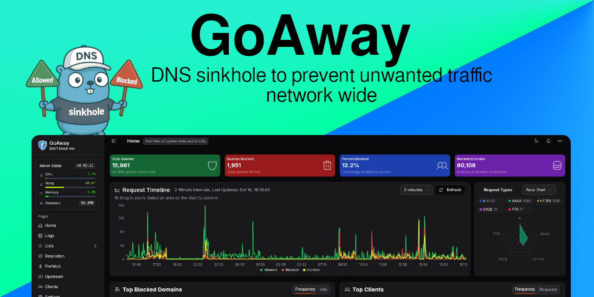

A lightweight DNS sinkhole for blocking unwanted domains at the network level. Block ads, trackers, and malicious domains before they reach your devices.

<a href="https://github.com/pommee/goaway/blob/improve-setup-and-structure/resources/PREVIEW.md" target="_blank">View more screenshots</a>

## Features

- DNS-level domain blocking
- Web-based admin dashboard
- Cross-platform / Docker support
- Customizable blocking rules
- Real-time statistics
- Low resource footprint
- And much more...
